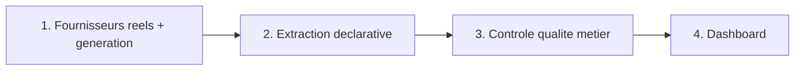

# Playbook — Extraction Structurée de Documents Métier

> Guide opératoire structuré en 4 volets (Définitions / Process / Documentation / Templates),
> pour comprendre, réutiliser ou transposer ce moteur d'extraction à un contexte réel.
> Rappel : projet personnel (POC), factures 100% simulées, fournisseurs réels (Sirene) — voir [`README.md`](README.md).

---

## 1. Définitions

**Vocabulaire du domaine**

| Terme | Définition |
|---|---|
| **Champ critique** | Champ dont l'absence est une anomalie d'extraction (ex. montant HT) ; un champ non-critique (ex. SIRET) peut légitimement manquer sur le document lui-même |
| **Trou d'extraction** | Champ critique non trouvé sur le document — problème du moteur ou du document, à corriger |
| **Incohérence métier** | Champs tous trouvés, mais valeurs contradictoires (ex. TTC ≠ HT + TVA) — problème de la facture elle-même, pas de l'extraction |
| **Vérité terrain** | Les valeurs réellement injectées à la génération (`data/raw/verite_terrain.csv`), utilisées pour évaluer la fiabilité du moteur, jamais montrées au moteur lui-même |

**Règles d'extraction** — patterns par champ, criticité, détaillées dans [`config/extraction_rules.yaml`](config/extraction_rules.yaml).

---

## 2. Process

1. **Fournisseurs & génération** (`src/entreprises.py`, `src/generator.py`) — fournisseurs réels via API Sirene (cache CSV), factures PDF générées avec variation contrôlée de format (date, présentation SIRET, libellé TTC) et anomalies injectées (incohérence de calcul, SIRET omis), seed fixe pour reproductibilité.
2. **Extraction** (`src/extractor.py`) — patterns lus depuis `config/extraction_rules.yaml`, essayés dans l'ordre par champ ; normalisation ensuite (date, montant, SIRET). Un champ non trouvé reste `None`, jamais une valeur par défaut.
3. **Contrôle qualité** (`src/quality_check.py`) — vérifie la cohérence des valeurs extraites avec succès (pas juste leur présence) : TTC = HT + TVA, date plausible, montants positifs. Distinct du moteur d'extraction par conception.
4. **Dashboard** (`dashboards/app.py`) — regénère et rejoue tout le pipeline en mémoire (`@st.cache_data`), affiche la répartition par statut et la file de vérification.

**Point de décision réutilisable** : séparer "champ non trouvé" (problème d'extraction) de "champ trouvé mais incohérent" (problème métier) évite de mélanger deux causes racines différentes dans un seul indicateur — un décideur sait immédiatement s'il doit corriger le moteur ou relancer le fournisseur.

---

## 3. Documentation

- [`README.md`](README.md) — vue d'ensemble, avancement, lancement local.
- [`PROMPT_LOG.md`](PROMPT_LOG.md) — méthode de construction avec l'IA, décisions et bugs réels.
- [`config/extraction_rules.yaml`](config/extraction_rules.yaml) — règles d'extraction déclaratives.
- [`data/raw/verite_terrain.csv`](data/raw/verite_terrain.csv) — vérité terrain (généré, gitignored).

---

## 4. Templates

**Ajouter un champ à extraire** : ajouter une entrée dans `config/extraction_rules.yaml` (`patterns`, `critique`), et si le champ a besoin d'une normalisation spécifique (autre que texte brut), ajouter une fonction dans `NORMALISATEURS` (`src/extractor.py`).

**Ajouter une règle de cohérence métier** : ajouter une fonction `controler_...` dans `src/quality_check.py` retournant une Série booléenne, puis l'intégrer dans `executer_controles()`.
