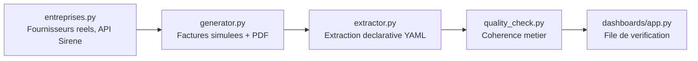

# Extraction Structurée de Documents Métier

🔗 **Démo live** : [extraction-documents-poc.streamlit.app](https://extraction-documents-poc.streamlit.app/)

⚠️ **Projet personnel (POC)** — démonstration de méthode. Fournisseurs **réels** (API Sirene officielle, `recherche-entreprises.api.gouv.fr`, licence ouverte, aucune clé requise) ; contenu des factures (numéros, montants, lignes) **entièrement simulé**. Aucune entreprise cliente ni ESN nommée.

Je voulais comprendre comment automatiser la saisie de factures fournisseurs sans faire aveuglément confiance à l'extraction : un moteur qui trouve tous les champs sur une facture peut quand même laisser passer une facture fausse (erreur de calcul du fournisseur), et un champ absent n'est pas toujours une anomalie (un SIRET omis reste une facture valable, juste incomplète) — alors j'ai construit ce projet, étape par étape.

## Ce que ça résout

Un service comptable ou ops qui reçoit des factures fournisseurs en PDF perd du temps en ressaisie manuelle et laisse passer des erreurs de calcul non détectées. Ce projet montre comment :
- générer un jeu de factures réalistes avec variation de mise en page contrôlée (fournisseurs réels via Sirene, contenu simulé),
- extraire les champs clés via un moteur déclaratif (règles YAML, pas de regex codée en dur),
- distinguer un **trou d'extraction** (champ non trouvé) d'une **incohérence métier** (champs trouvés mais valeurs contradictoires, ex. TTC ≠ HT + TVA),
- produire une file de vérification priorisée plutôt qu'un simple tableau de données brutes.

## Architecture



## Avancement

Projet construit pas à pas, étape validée avant de passer à la suivante.

- ✅ **Étape 1 — Fournisseurs réels & génération de factures** (`src/entreprises.py`, `src/generator.py`) : 85 fournisseurs réels téléchargés (4 secteurs NAF, 4 départements), 40 factures PDF générées avec 3 familles de variation contrôlée (format de date, présentation du SIRET, ~12% d'incohérences de calcul TTC injectées après coup, ~10% de SIRET omis du document), seed fixe.
- ✅ **Étape 2 — Moteur d'extraction déclaratif** (`src/extractor.py`, `config/extraction_rules.yaml`) : chaque champ a une ou plusieurs regex candidates lues depuis le YAML, essayées dans l'ordre. Un champ non trouvé reste vide plutôt que rempli par une valeur par défaut. Sur le dernier lot généré (40 factures, seed fixe) : 0 champ critique manquant, les 5 SIRET absents du document correctement signalés comme non trouvés plutôt que devinés.
- ✅ **Étape 3 — Contrôle qualité métier** (`src/quality_check.py`) : vérifie la cohérence des valeurs extraites (TTC = HT + TVA à l'arrondi près, date plausible, montants positifs), détecte les 2 incohérences de calcul injectées. SIRET manquant traité séparément (non-critique par design), n'entache pas seul le statut d'une facture.
- ✅ **Étape 4 — Dashboard** (`dashboards/app.py`) : vue d'ensemble (répartition par statut, écarts TTC), file "Factures à vérifier", détail complet, et transparence sur les règles d'extraction déclarées (aucune codée en dur).
- ✅ **Tests** (`tests/test_extraction.py`) : 26 tests Pytest — normalisation des champs (date, montant, SIRET), comportement du moteur de patterns, règles de cohérence métier, cas limites (données incomplètes, SIRET manquant qui ne doit pas faire basculer le statut seul), score de confiance, précision mesurée.
- ✅ **Étape 5 — Upload réel, score de confiance, précision mesurée** (28/08) : onglet d'upload d'une vraie facture PDF (extraction en direct, testée hors des 40 factures de démo), score de confiance par champ dérivé de signaux réels (pattern matché, succès de la normalisation — `extractor.ChampExtrait.confiance`), précision globale mesurée contre une vérité terrain connue (`src/eval.py`, 100% sur le jeu de démo).

## Stack

Python · Pandas · pdfplumber (extraction PDF) · ReportLab (génération PDF) · PyYAML (règles déclaratives) · Streamlit · Pytest.

## Lancer en local

```bash
pip install -r requirements.txt

# En ligne de commande, étape par étape :
python src/entreprises.py       # telecharge les fournisseurs reels (Sirene) -> data/raw/fournisseurs_reels.csv
python src/generator.py         # genere 40 factures PDF -> data/factures_pdf/, verite terrain -> data/raw/verite_terrain.csv
python src/extractor.py         # extrait les champs de chaque facture PDF
python src/quality_check.py     # applique les controles de coherence metier

# Ou directement le dashboard (regenere et rejoue tout le pipeline si besoin) :
streamlit run dashboards/app.py

# Tests
pytest tests/ -v
```

## Pour une mission réelle

Cette architecture se transpose à un service comptable, un pool de facturation fournisseurs, ou tout flux documentaire structuré à extraire (contrats, bons de commande) : livraison d'un premier moteur d'extraction + file de vérification en 5 à 7 jours ouvrés, adapté à vos formats de documents réels et vos règles de cohérence métier. Contact via [Sovereign Career](https://www.sovereigncareer.fr/freelance/freelance-consultant-data-steward-gisele-metouck).

---

Playbook complet (Définitions/Process/Documentation/Templates) : [`PLAYBOOK.md`](PLAYBOOK.md).
Construit avec l'IA — méthode documentée dans [`PROMPT_LOG.md`](PROMPT_LOG.md).
**Gisèle Metouck** — Consultante Data Steward & Gouvernance · [GitHub](https://github.com/Kingdmfncr)
